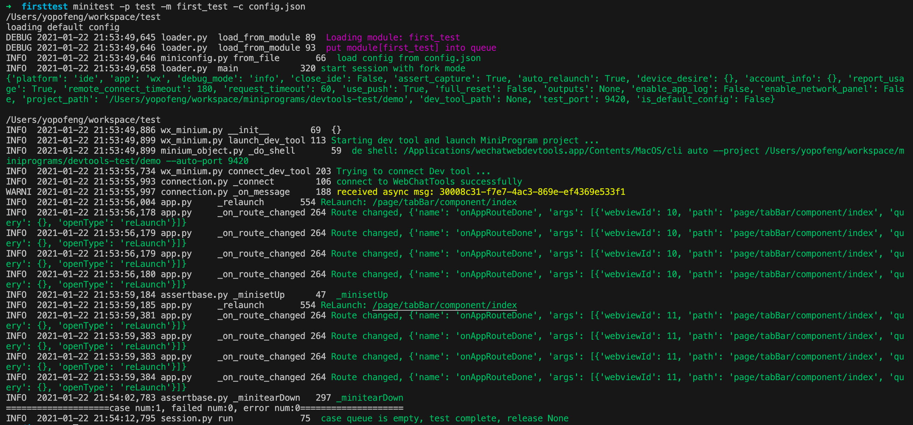
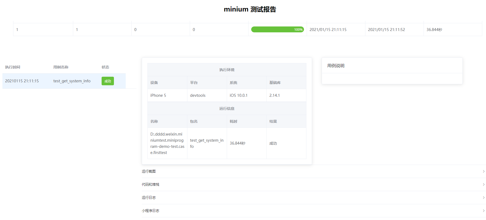

# 一个简单例子
**在尝试运行之前，请确保已经准备好[环境](/minium/Python/introduction/quick_start#运行环境)和了解一些[必要的知识](/minium/Python/introduction/quick_start#必要的知识)**

## 目录结构
按照以下结构新建目录及文件

```
.
├── test
│   └── __init__.py
│   └── first_test.py
└── config.json
```

## 编写第一个case
编辑case文件`first_test.py`

```python
#!/usr/bin/env python3
import minium
class FirstTest(minium.MiniTest):
    def test_get_system_info(self):
        sys_info = self.mini.get_system_info()
        self.assertIn("SDKVersion", sys_info)
```

## 编写配置文件
编辑配置文件`config.json`
```json
{
  "project_path": "path/to/project",
  "dev_tool_path": "path/to/cli",
  "debug_mode": "debug"
}
```
**需要替换以上`path/to/project`和`path/to/cli`为真实路径，参考[必要的知识](/minium/Python/introduction/quick_start#必要的知识)**
更多配置信息请参考[测试配置](minium/Python/framework/config)

## 运行case
```
minitest -m test.first_test -c config.json -g
```
!> `test.first_test`是python包名，不要跟path搞混

更多命令行参数请参考[命令行工具](minium/Python/framework/commandline)

运行结果如下:



## 查看结果
测试结果存储在`outputs`下，运行命令`python3 -m http.server 12345 -d outputs`然后在浏览器上访问`http://localhost:12345`即可查看报告，如图：

