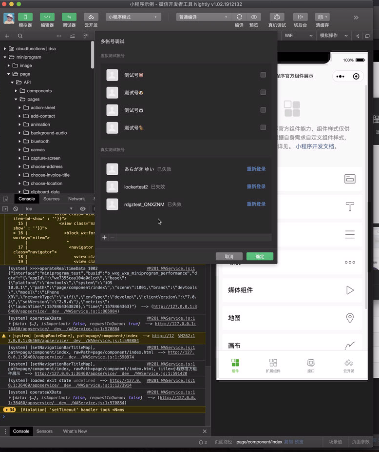
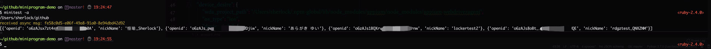
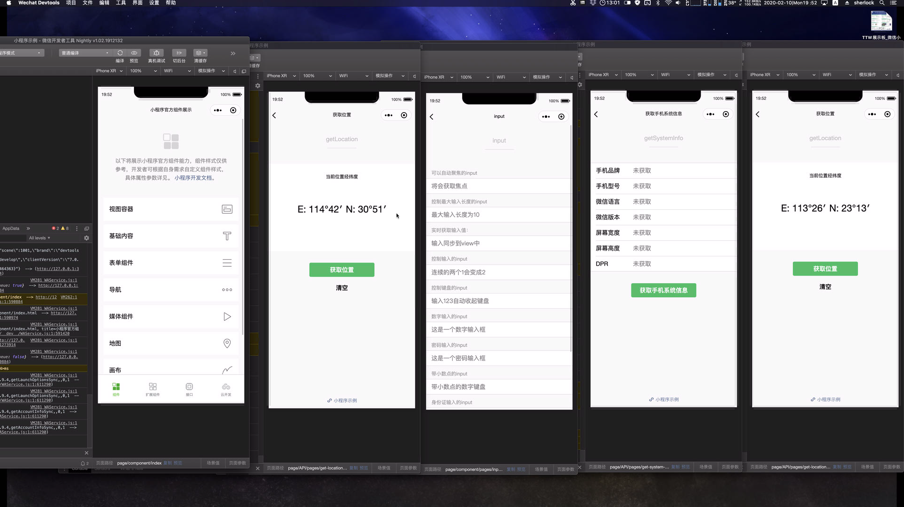

# 多账号

!> 公共库 2.10.0 之后支持

1. 使用多账号并行测试首先需要在开发者工具登录多个账号



2. 获取登录账号的 open id
   
    2.1 先以自动化模式打开开发者工具，端口默认 9420

    2.2 minitest -a 获取 open id
    

    *PS: 获取到的帐号openid不包括登录的主帐号，只包含多账号调试中的`真实测试帐号`，主帐号不需要配置`account_info`*

3. 创建配置文件，形式如下，你需要将 open id 和 udid 替换成你自己的账号和设备，保存为 m_config.json

```json
[{
    "debug_mode": "debug",
    "enable_app_log": true,
    "project_path": "/Users/sherlock/github/miniprogram-demo",
    "dev_tool_path": "/Applications/wechatwebdevtools.app/Contents/MacOS/cli",
    "platform": "ide",
    "app": "wx",
    "close_ide": false,
    "test_port": 9421,
    "assert_capture": true,
    "use_push": true,
    "auto_relaunch": true,
    "remote_connect_timeout": 10,
    "account_info": {
        "wx_nick_name": "locker",
        "open_id": "o6zAJs_pwr**********aROZDjiw"
    },
    "device_desire": {
        "wda_project_path": "/Users/sherlock/.npm-global/lib/node_modules/appium/node_modules/appium-webdriveragent",
        "os_type": "ios",
        "device_info": {
            "udid": "aee531018e668ff1aad*************2924e8",
            "model": "iPhone 6",
            "version": "12.2.5",
            "name": "sherlock's iPhone"
        }
    }
},
{
    "debug_mode": "debug",
    "enable_app_log": true,
    "project_path": "/Users/sherlock/github/miniprogram-demo",
    "dev_tool_path": "/Applications/wechatwebdevtools.app/Contents/MacOS/cli",
    "platform": "ide",
    "app": "wx",
    "close_ide": false,
    "test_port": 9422,
    "assert_capture": true,
    "use_push": true,
    "auto_relaunch": true,
    "remote_connect_timeout": 10,
    "account_info": {
        "wx_nick_name": "恒瑜_Sherlock",
        "open_id": "o6zAJsx7zt4***********Tz7Kx10A"
    },
    "device_desire": {
        "wda_project_path": "/Users/sherlock/.npm-global/lib/node_modules/appium/node_modules/appium-webdriveragent",
        "os_type": "ios",
        "device_info": {
            "udid": "aee531018e668ff1***********ebe21a22924e8",
            "model": "iPhone XR",
            "version": "12.2.5",
            "name": "sherlock's iPhone"
        }
    }
}]
```


4. 启动测试

```shell
$ minitest -s suite.json -c m_config.json -g
```

5. 静候



***PS: 上图为了方便展示，platform 配置项都设置为 ide，真机运行只需将 platform 设置为 iOS 或者 Android，并填写好设备 udid 即可，跟之前单机真机运行的步骤一致***

