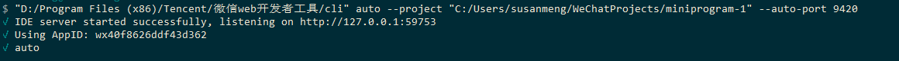
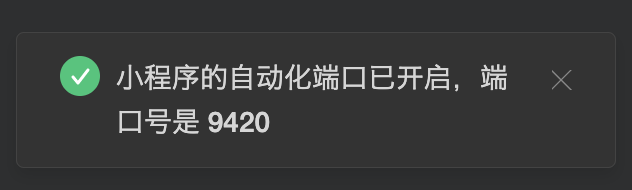

# 快速开始

## 运行环境

- Python 3.8及以上
- [微信开发者工具](https://developers.weixin.qq.com/miniprogram/dev/devtools/download.html) (本文档中简称IDE)最新版本，并打开[安全模式](https://developers.weixin.qq.com/miniprogram/dev/devtools/settings.html#%E4%BB%A3%E7%90%86%E8%AE%BE%E7%BD%AE):
`设置 -> 安全设置 -> 服务端口: 打开`
- [微信](https://weixin.qq.com) >= 7.0.7 (确认微信公共库版本 >= 2.7.3即可)

## 必要的知识

本框架与开发者工具有强关联，如果你之前对开发者工具没有基本的了解，可以点击下面的链接了解一些必要的知识：

- Python3 [官网文档](https://docs.python.org/3.0/) [简单教程](http://www.runoob.com/python3/python3-tutorial.html)
- 开发者工具
    - [开发者工具的界面](https://developers.weixin.qq.com/miniprogram/dev/devtools/page.html)
    - [真机调试](https://developers.weixin.qq.com/miniprogram/dev/devtools/remote-debug.html)
    - [命令行调用](https://developers.weixin.qq.com/miniprogram/dev/devtools/cli.html)
- 路径说明
    - `path/to/project`: 指代填写存放小程序源码的目录地址，文件夹中需要包含有`project.config.json`文件
    - `path/to/cli`: 指代开发者工具`cli`命令路径。macOS: `<安装路径>/Contents/MacOS/cli`， Windows: `<安装路径>/cli.bat`

## 安装

- 自动安装

```
pip3 install https://minitest.weixin.qq.com/minium/Python/dist/minium-latest.zip
```

- 手动安装
下载[minium安装包](https://minitest.weixin.qq.com/minium/Python/dist/minium-latest.zip), 解压后进入文件夹, 运行

```shell
python3 setup.py install
```

## 环境检查
1. minium安装完成后，可执行以下命令查看版本：
```shell
minitest -v
```
出现如以下内容的构建信息则已安装成功
```log
{'version': '1.1.0', 'revision': '2fac2e36c281213874110f2088bc08c570bc1a2d', 'branch': 'master', 'update_at': '2021-08-05 21:17:09'}
```
2. 开发者工具自动化能力检查
```
"path/to/cli" auto --project "path/to/project" --auto-port 9420
```
路径参考[必要的知识](#必要的知识)<br>
有类似以下log并且开发者工具上有以下提示的则通过，否则根据提示和[开发者工具文档](https://developers.weixin.qq.com/miniprogram/dev/devtools/cli.html)调试解决




## 开始使用
以下是参考代码，输出[system_info](https://developers.weixin.qq.com/miniprogram/dev/api/base/system/system-info/wx.getSystemInfo.html)
```python
import minium
mini = minium.Minium({
    "project_path": "path/to/project",   # 替换成你的【小程序项目目录地址】
    "dev_tool_path": "path/to/cli",      # 替换成你的【开发者工具cli地址】，macOS: <安装路径>/Contents/MacOS/cli， Windows: <安装路径>/cli.bat
})
print(mini.get_system_info())
```
输出内容类似以下
```
{'model': 'iPhone 5', 'pixelRatio': 2, 'windowWidth': 320, 'windowHeight': 456, 'system': 'iOS 10.0.1', 'language': 'zh_CN', 'version': '8.0.5', 'screenWidth': 320, 'screenHeight': 568, 'SDKVersion': '2.16.0', 'brand': 'devtools', 'fontSizeSetting': 16, 'benchmarkLevel': 1, 'batteryLevel': 71, 'statusBarHeight': 20, 'safeArea': {'top': 20, 'left': 0, 'right': 320, 'bottom': 568, 'width': 320, 'height': 548}, 'deviceOrientation': 'portrait', 'platform': 'devtools', 'enableDebug': False, 'devicePixelRatio': 2}
```

## 更多能力
- 以上是minium接口的基本用法，minium还集成了测试框架，给你提供更多的测试能力。详情见[测试进阶](minium/Python/framework/introduction)
- 更多`用例`和`测试小程序demo`[点击前往](https://git.weixin.qq.com/minitest/minitest-demo.git)

## 常见问题排查

见[FAQ](/minium/Python/other/faq.md)

