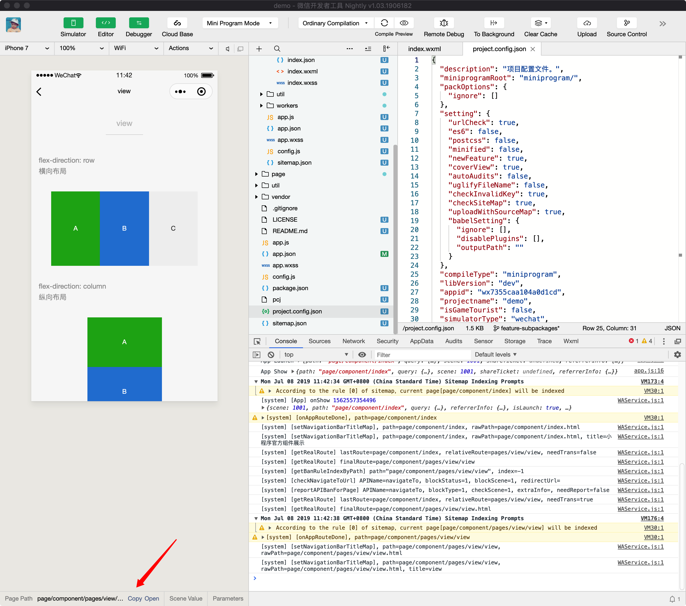
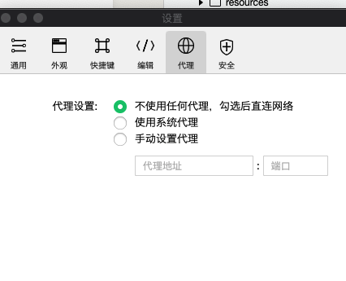
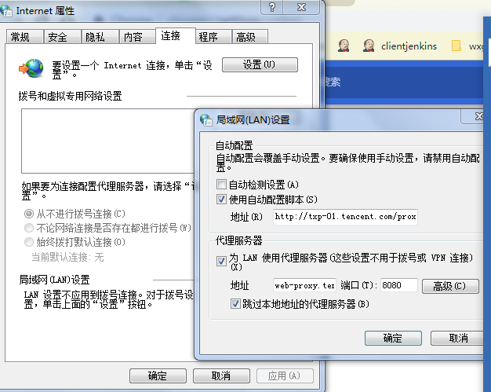
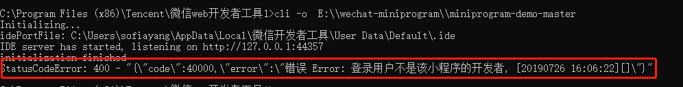
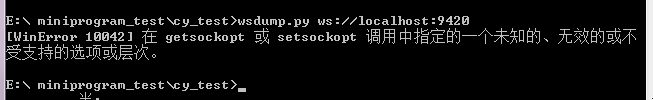
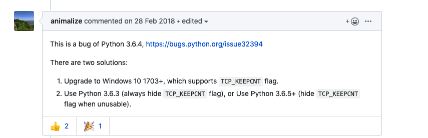
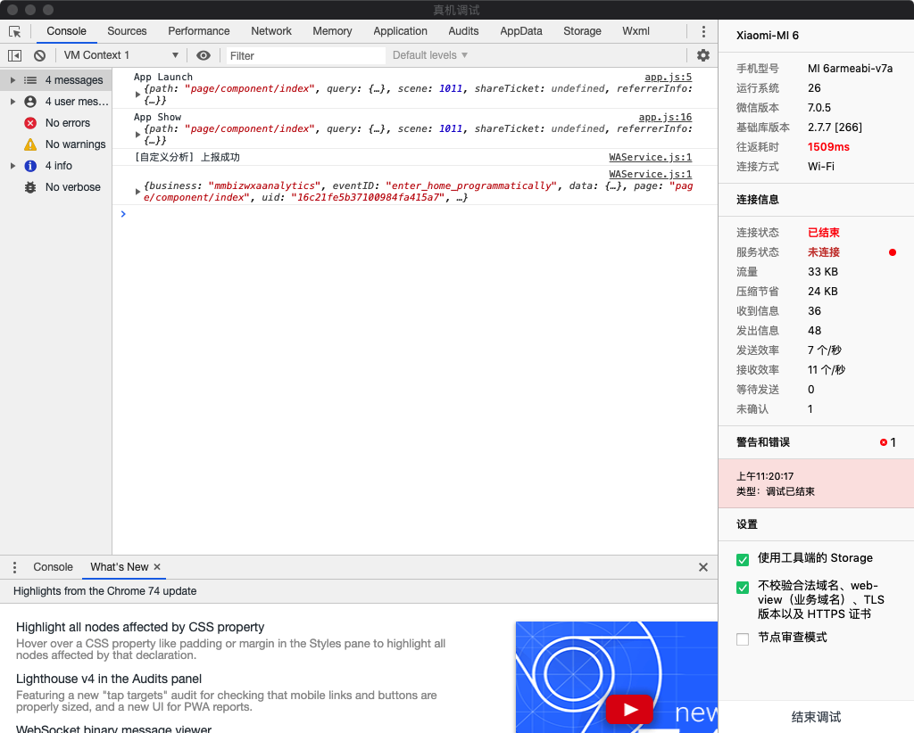
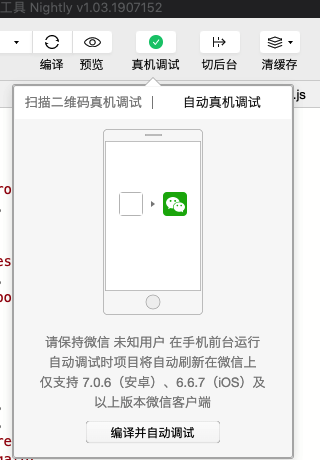

# FAQ

## 反馈问题
> 如何反馈问题或提供建议?

使用问题/建议可到[微信开放社区](https://developers.weixin.qq.com/community/blog/create/1?blocktype=1&questionCategory=32)反馈，标题带上【minium】/【minitest】字段， 感谢你的反馈和宝贵的建议

## 报告无法生成问题
> 为什么最后没有生成minium的测试报告？

一般这种问题，优先查下是不是用例中没有继承minium的teardown

```
import minium
class FirstTest(minium.MiniTest):   
	def tearDown(self):        
		super(FirstTest,self).tearDown()
```

## 接口用法问题

> 开发者工具上无法处理的弹窗

`showModal/showActionSheet/各种授权弹窗/地图` 等控件在开发中工具上无法处理，此处参考[mock_native_modal配置项](minium/Python/framework/config.md#ide的mock_native_modal配置项)进行mock接口数据的配置

> native接口问题

native接口在ide上需要配合[`mock_native_modal`](minium/Python/framework/config.md#ide的mock_native_modal配置项)使用。即`platform=ide`时，只有配置了mock_native_modal后，调用native的接口才生效

> 开发者工具底部显示的路径问题



    page/component/pages/view/view

这里显示的是绝对路径，使用的时候需要在最前面加上“/”

    /page/component/pages/view/view

## 环境问题

> Can't wait until App.initialized

minium发起了远程调试，但手机没有正常启动小程序/白屏。可以尝试手动切换成`二维码真机调试`后再切换`自动真机调试`。还是不行，请先确认`远程调试`功能正常

> dev_tool_path: xxxxx not exists

- 请参考开发者工具的[命令行工具](https://developers.weixin.qq.com/miniprogram/dev/devtools/cli.html)排查环境问题。
- 在minium配置文件中配置`dev_tool_path`路径或实例化的时候加上`dev_tool_path`选项。参考[测试配置](minium/Python/framework/config.md)或[例子](#开始使用)

> receive from remote timeout, id:xxxxxxxxxxx

在开始运行阶段遇到这样类似的报错，大概率是因为调试基础库（公共库）版本过低导致的。可以去开发者工具->详情->本地设置选择最新版本的调试基础库（公共库）

> module 'websocket' has no attribute 'WebSocketApp'

`pip3 list` 查看是否安装了 `websocket`，如果有执行 `pip3 uninstall websocket` 卸载 `websocket` 即可。

> Windows 路径问题

如果我们直接从windows的文件浏览器中粘贴路径名到配置文件，会出现json文件格式错误，可以把'\\'替换成'\\\\'。

> 代理问题

如果启动 IDE 或者运行脚本的时候发现出现连接超时等错误，Windows请确认下面两个设置是否如下图所示：




如无法解决，请联系`@lockerzhang`、`@xiazeng` 或者`@yopofeng` 帮忙协助解决，这大多数情况是因为公司的网络策略出现的问题，具体问题具体分析。

> 项目无法打开

如果命令行启动开发者工具的时候无法打开项目，请确认以下事项：

1. 检查你是否有该小程序的开发者权限：
    

2. 开发者工具版本是否最新，在这里下载最新的开发者工具：
    [https://developers.weixin.qq.com/miniprogram/dev/devtools/nightly.html](https://developers.weixin.qq.com/miniprogram/dev/devtools/nightly.html)

> WinError 100421

Python 3.6.4 的 bug，请更新 Python 版本


https://github.com/websocket-client/websocket-client/issues/404


> 其他问题引起小程序项目不能自动在开发者工具打开

参考[环境检查](#环境检查)进行排查

## 真机调试问题

> iOS真机问题

iOS：iOS 真机下面运行出现问题，大多数情况是 WDA 运行的问题，可以参考本文的 WDA 设置指引：[真机测试](minium/Python/framework/mobile?id=ios)。

> Android真机问题

操作Native组件需要安装apk，但是有部分手机的弹框不能处理掉，第一次安装失败可以手动安装。apk包含在安装包中，可以输入`minitest --apk`

> 连接超时问题

控制台出现`Exception: receive from remote timeout, id: f933c71e-bc2b-41b7-b286-29c65dd0d4d8`报错时，一般是因为ide的通道被远程调试占用了，请检查ide是否有打开

1. 调试窗口（包括上一次打开未关闭的）

    

2. 正在显示真机调试的二维码或者自动真机调试

    

3. 开发者工具的公共库版本过低，请确保选择了最新的公共库，`2.7.3`以上

    如果有上述界面，请关闭再重试


